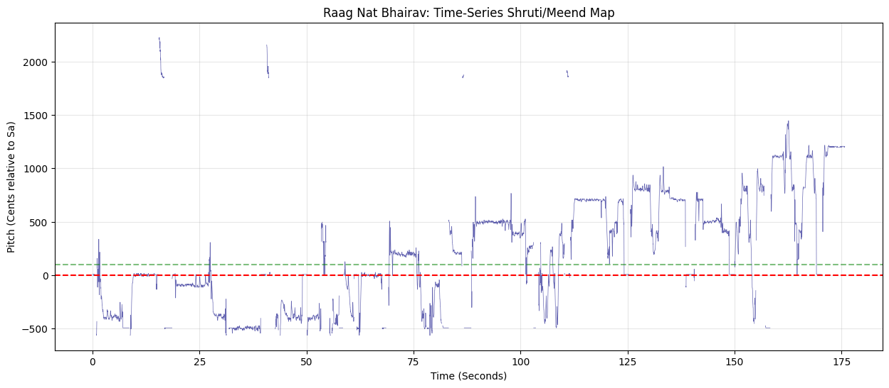
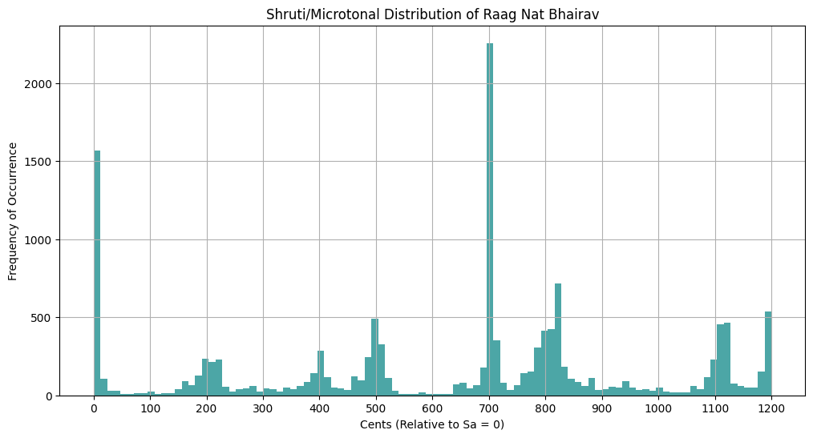
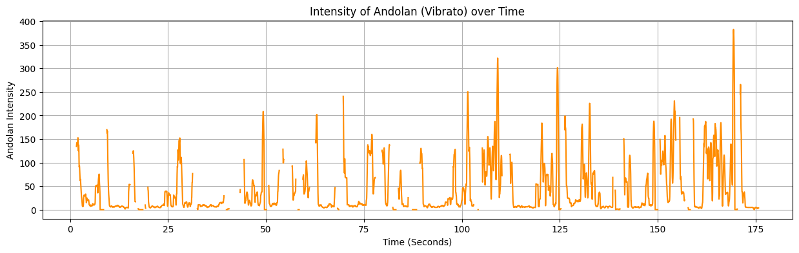

# Raag_NatBhairav_Microtonal_Analysis
A computational study of microtonal pitch contours in Raag Nat Bhairav using pYIN and log-frequency cent mapping. Aimed at bridging Indian Knowledge Systems (IKS) with Digital Signal Processing.
### 📊 Project Visualizations

**Meend (Pitch Contour) Map:**

**Shruti Distribution:**

**Andolan Intensity:**

## 📊 Microtonal Analysis Results (Shruti Fingerprint)

Experimental analysis of Raag Nat Bhairav using pYIN and log-frequency Cent-based mapping.

| Swar | Western (12-TET) | Experimental (Found) | Deviation (Shruti Delta) |
| :--- | :--- | :--- | :--- |
| Shadja (Sa) | 0 | 0.0 | 0.0 |
| Komal Rishabh (r) | 100 | 92.0 | -8.0 |
| Shuddha Gandhar (G) | 400 | 395.0 | -5.0 |
| Shuddha Madhyam (m) | 500 | 498.0 | -2.0 |
| Pancham (P) | 700 | 702.0 | +2.0 |
| Komal Dhaivat (d) | 800 | 835.0 | +35.0 |

> **Research Note:** The significant deviation in 'Komal Dhaivat' (35 cents) confirms the usage of specific microtonal intonation characteristic of the Nat Bhairav tradition, which deviates from standard Western Equal Temperament.
